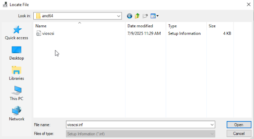
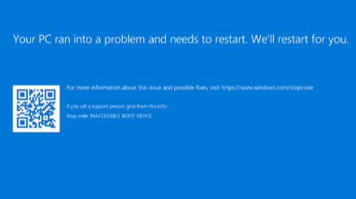
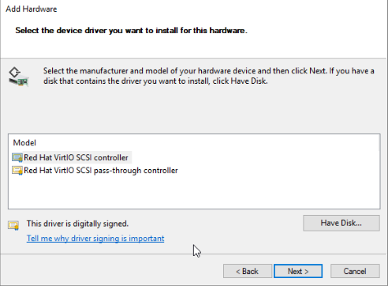
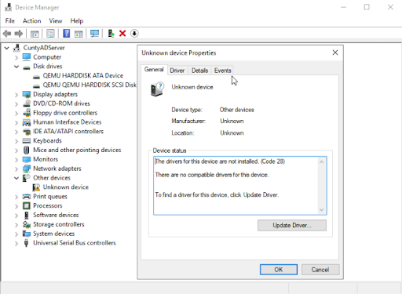

## DISCLAIMER!!
This is not tech advice, this is not a tutorial. For those much more technically inclined than I, you will likely cringe at the mistakes I make. But if you are a beginner perhaps this could aid you in your desperate searches for the exact problem you are encountering. And if you are not then maybe my blundering could provide entertainment.

If you want an overview of my hardware and current config you can refer to my previous posts:

[My Homelab Server Overview](/p/overview/)
[My Homelab Current VMs/Services](/p/current-config/)

## I had a problem...
My VMs were sluggish, like way more sluggish than is even reasonable for my conservative hardware allocation. Changing settings in AD and just using the OS was painful. I experimented by allocating more RAM, more cores, etc... but it was still so **SO** slow!

So I did some research and found that IDE is one of the slowest HDD types you can use in proxmox. This is because there is much more overhead when emulating this kind of legacy hardware technology. I believe this was causing my high CPU usage and slow speeds. Safe to say, converting my virtual storage to SCSI would at least help alleviate this slow performance I was seeing.

For some reason I assumed the drivers would be preinstalled so I simply detached my hard drive, changed it to SCSI and then attached it again. Nope obviously nothing can be that easy its technology. So I finally searched up the documentation showing how to do it, read through it and felt confident it would be a breeze.

I changed my drive back to IDE, and attached an ISO with the Windows VirtIO SCSI Guest drivers.

So I went in installed the drivers using the installer and thought, easy peasy! They were showing in device manager and everything. I swapped the drive back to SCSI and boom. BSOD...

Okay... time to pivot I suppose. So I reset everything and installed the drivers using the device manager "Add Legacy Hardware" option. 

And the drivers were showing a bit differently. I was seeing this "Unknown Device" that said there was no device for these drivers. I tried to swap the drive to SCSI and another BSOD. So I figured, heck lets throw on a device for it to use then maybe it'll force it to recognize the drivers.

I attach a little 1 GB SCSI drive to the VM and boot it back up. I click the SCSI drive in device manager and this time I install the drivers through the "update driver" button on this device. It works and so I test it out by turning the drive online, initializing it, and even formatting and creating a text file on it. 

And it works! I swap the main drive to SCSI and finally it boots right to Windows no more BSOD. I guess creating a little test SCSI drive helped finish the post driver installation.

## The problem I was facing:
* BSOD after BSOD saying INACESSIBLE_BOOT_DEVICE despite installing drivers in every way possible
* Drivers showing perfectly in the device manager yet not working when change IDE HDD to SCSI
* Even the driver service was showing as running using an SC query
* Code 31 :“This device isn't working properly because windows cannot load the drivers required for this device."
* "A device which does not exist was specified."
* Warning flag on SCSI controller in device manager

## How I managed to fix it:
1. Loaded up Win with regular IDE settings **EXCEPT** SCSI controller as VirtIO SCSI single and the ISO with VirtIO Guest drivers attached.
2. Attach a test SCSI HDD, only 1GB or so.
3. Booted up the VM.
4. Installed the VirtIO drivers from the ISO storage controller. I used the path amd64\2k19\vioscsi however on my second machine the vioscsi\2k19\amd64\vioscsi path also worked. So it might be worth trying both if you are encoutering issues.
5. I didn't think this part actually mattered but as I will explain in the next few paragraphs **the test SCSI drive must stay connected when you reboot your main drive as SCSI.** I also initialized and created a volume on this drive.
6. You should be able to swap your IDE drive to SCSI now and it will no longer throw an inaccessible boot device BSOD.

## My biggest headache and why I believe the test SCSI drive must stay connected

Since I successfully swapped my ADDNS server from IDE to SCSI I figured it would be simple to swap my WINSERV VM over as well. So I started with the same steps, I added test drive installed drivers initialized the test drive. But when I went to swap my main drive to SCSI I got another BSOD. I swear I am going to see that error message in my nightmares...

So I reattached the test drive back on in an effort to try and backstep. But alas that did not fix it so I completely restarted and tried to do the process all over again. 

I kept the test SCSI drive attached. But I got another BSOD... time to restart AGAIN. This time I was extra careful did it the EXACT same way. It might be worth noting that the only time it finally worked was when I pressed update drivers and installed my VirtIO drivers via the “Unknown Device”. Rather than doing the normal method of Storage Controllers -> Action -> Add Legacy Hardware -> etc…

After this little charade of resetting and trying again I was finally able to boot my regular drive with SCSI then delete the test drive. I genuinely feel like my sanity was hanging onto this little 2GB test SCSI drive. Thank you little SCSI drive for carrying my body through the pearly gates of post driver installation!
