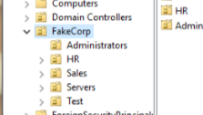
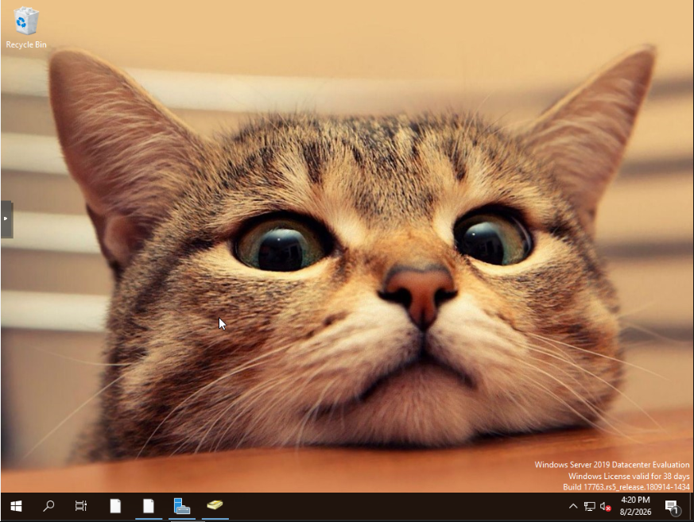
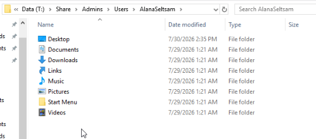

## What services I have set up so far:

Currently I am running Proxmox with 4 virtual machines. Each VM has a specific purpose and plan for its roles/services in my environment.

My current setup consists of:
* Jellyfin Server 
* ADDNS (Active Directory / DNS)
* WINSERV (File Server)
* Saitama (Domain-Joined Test Machine)

## Jellyfin-Server:
As the name suggests, this is running Jellyfin. 

The media library is stored on a seperate Samba file share. I chose this setup so that I could download the media and upload it to the file share with my personal computer.

I access my home network remotely via Tailscale, so that my friends and family can utilize my Jellyfin server. This has been a hit with them and frankly, it is the only reason why my roomates put up with my stupidly loud server in the office (sorry guys). 

## ADDNS:

This is my domain controller! 

I am running Windows Server 2019 and have configured my own Active Directory domain. Currently, my fictional organization is "FakeCorp". This company is organized into 5 OUs consisting of Admins, HR, Sales, Servers, and a Test OU.

Right now, I have one primary admin account that I use for all my configuration tasks domain wide. Eventually, I would like to implement more granular administrative permissions following the principle of least privledge and zero trust.

My current Active Directory configurations include:

* Global and OU specific GPOs 
* Password policies
* Wallpaper deployment
* LAPS configuration for local admin passwords
* Domain-wide DNS

My domain controller handles DNS internally, but it just forwards to my local network DNS.

I also configured folder redirection with the goal of creating completely mobile domain users, like I have seen in many enterprise environments. Where users can access their files and settings regardless of which domain-joined machine they log into.

## WINSRV:
This VM is also running Windows Server 2019 was originally created to be a central file share for all domain files. I slapped 2 drives on this VM one for the OS and the other for the file share. This is where the global assets are stored such as the backgrounds, login scripts, and software.

This also holds all the file shares and folder redirections for each OU.

## Saitama:
Saitama is my domain-joined test machine. Shout out if you get the name reference, also my deepest condolences for season 3. 

I use this VM to log in as all the users I create and verify that GPOs, permissions, and other configs are being applied correctly. Most of my troubleshooting workflow consists of bouncing between ADDNS/WINSRV and Saitama over and over again while a solemn tear rolls down my eye.

Then I eventually discover I forgot to configure one tiny setting somewhere.

