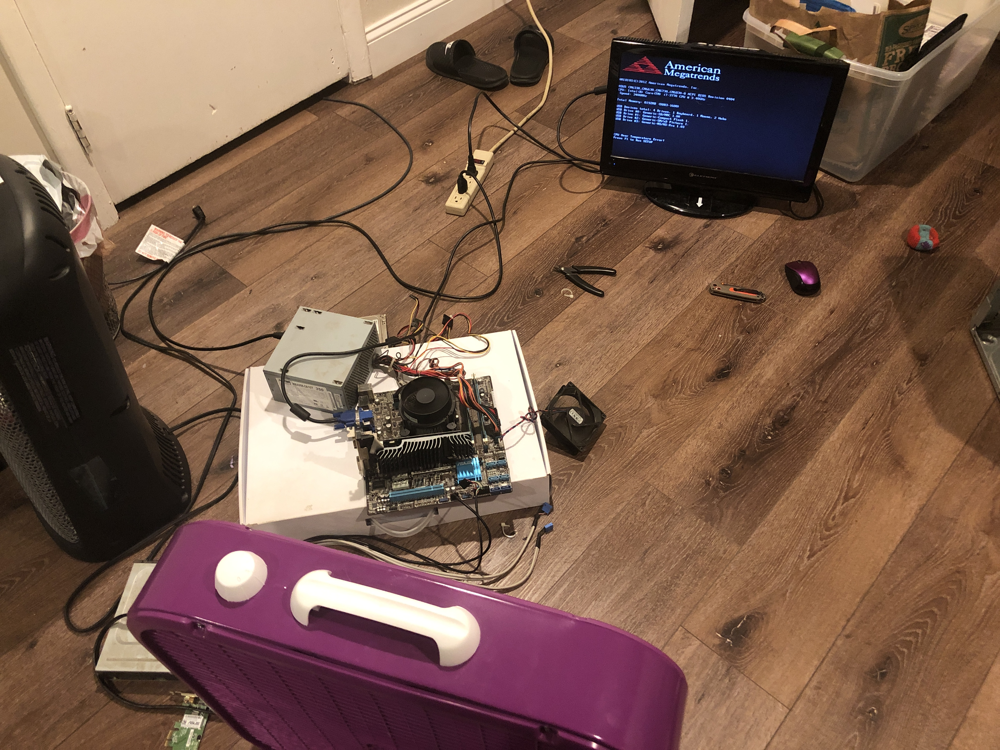

# My name is Alana!

I am an IT student based in the Mountain West, and this blog is where I document my journey through technology, homelabbing, and everything I learn along the way.

I started my homelab about a year ago as a way to push myself beyond the classroom and get hands-on experience with the systems, services, and troubleshooting that make up the world of IT. This blog is not meant to be a collection of perfect tutorials; it is a record of my projects, troubleshooting adventures, mistakes, and the lessons I learn while building my skills. 

Some things will work perfectly. Some things will probably break spectacularly. Either way, I will learn something and have fun while doing it.

---

## How did I get into tech?

I have had my nose in a computer for as long as I can remember. But for a long time I never thought about how they worked. Don't get me wrong, of course I was modding minecraft and poking holes in my network so me and my friends could play on my server. But I never looked deeper than that.

That changed in high school when my gaming PC stopped turning on. After some frantic googling/troubleshooting, I found out my power supply was shot. As a broke teenager I decided just buying the part would be the cheapest option, and surely replacing one part would be easy?

Spoiler: it was not.

I had never even **SEEN** the inside of a computer let alone taken one apart. So I opened the case and just stared at the maze of computer guts, totally confused. But I already had the part so I took some photos, and started unplugging. I went to install the new PSU and was totally freaked out. It took me maybe 2 hours of googling, reviewing my pictures, and a little bit of crying thinking I was going to brick my expensive gaming PC. 

However, I finally finished and the satisfaction of clicking that power button and it finally humming to life got me hooked.

From there, I started tearing apart some of the older junk PCs I had lying around. I wanted to delve deeper and figure out what all of these random hunks of plastic actually were.

I moved schools in my Senior year and my new school offered computer hardware/OS and scripting classes. I was totally over the moon and these classes served as a jumping off point for my budding tech addiction. I went home and purchased a few textbooks for the CompTIA A+, I would sneak these books into my other classes and secretly study them. 

When I graduated, I continued my path by applying at a local community college to major in Information Technology. I fell in love with being able to turn my curiosity into practical skills. Yes, I was the annoying student who would raise my hand every two seconds to ask a question. And yes I was the extra annoying student who would stay late after class just to ask my instructor 1 million more questions I didn’t have time to ask in class.

I earned my first job in IT in 2024 and then graduated with my Associate in 2025. Now I am searching for more opportunities to develop my skills and prove myself in my career. Hence, why I am cultivating my homelab.

## Why a homelab?

In college I was taking all of these classes learning about theories, best practices, and demonstrations. But I was left a bit unsatisfied because I learn best by **doing**. I wanted to get my hands in there, break things and fix them before I ever touch a production environment. 

My homelab is precious to me. It’s where I get to explore virtualization, networking, servers, and any and all technology that interests me. This blog is to document my process.

So, welcome to my little corner of the internet. I am hoping people can learn something, laugh at my mistakes, or at least enjoy watching me figure things out.

